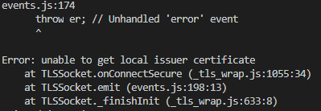
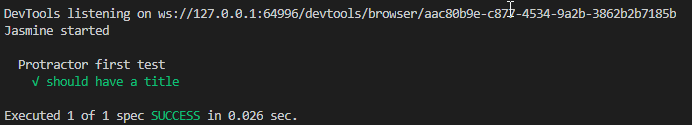

# Protractor E2E Testing Development Environment Setting
In order to make Workshop practice smoothly, please prepare your protractor runtime environment in advance.

## [Operating System]
* Windows 7 and above
* Mac OSX 10.6 and above
* The latest of Linux distro

## [Browser]
### Google Chrome 
* Update to the latest versoin please.
* Highly recommend installing [Copy css Selector](https://chrome.google.com/webstore/detail/copy-css-selector/kemkenbgbgodoglfkkejbdcpojnodnkg?hl=en-US) extension.

### Mozilla Firefox
* Update to the latest versoin

## [Package Manager]
If you don't use Mac OSX, skip this step please.
### Mac OSX Only
[Homebrew - The missing package manager for macOS](https://brew.sh/)
* Only for bash, zsh shell. (Mac bash by default)

## [IDE]
### Git
If you install Git for the first time, set up your username and e-mail, please.

> ### Windows
> [Git](https://git-scm.com/)

> ### Mac OSX
> ```zsh
> :~$ brew install git
> ```


### Node.js
Recommend to install version v10.16.3LTS

> #### Windows
>[Node.js](https://nodejs.org/download/release/v10.16.3/)

> #### Mac OSX
> ```zsh
> :~$ brew install node@10
> ```

* #### Check after instlled
    ```zsh
    :~$ node -v
    ```
    Confirm the version is v10.16.3LTS.
    
    ```zsh
    :~$ npm -v
    ```
    Confirm the version is v6.9.0.


### Visual Studio Code
[VS Code](https://code.visualstudio.com/)
* Install extension [Prettier](https://marketplace.visualstudio.com/items?itemName=esbenp.prettier-vscode)
* Install extension [TSLint](https://marketplace.visualstudio.com/items?itemName=ms-vscode.vscode-typescript-tslint-plugin)
* Install extension [JavaScript (ES6) code snippets](https://marketplace.visualstudio.com/items?itemName=xabikos.JavaScriptSnippets)
* Install extension [Todo Tree](https://marketplace.visualstudio.com/items?itemName=Gruntfuggly.todo-tree)

### Java SE Runtime Environment 1.8
[JRE 1.8](https://www.oracle.com/technetwork/java/javase/downloads/jre8-downloads-2133155.html)
You have to install JRE 1.8 and above to execute the Selenium Standalone Server, if you need.
Please install via http://sam/ if you can't download from the Oracle site.


* #### Check after instlled
    ```zsh
    :~$ java -version
    ```
    Confirm the version is v1.8 and above.


## [Protractor, Webdriver-manager]
### Protractor
```zsh
:~$ npm install -g protractor
```
Install protractor, webdriver-manager and Protractor API

* #### Check after instlled
    ```zsh
    :~$ protractor --version
    ```
    If any version information displayed, that means Protractor works.

### webdriver-manager keeps up to date
```zsh
:~$ webdriver-manager update
```
The webdriver-manager is a helper tool to easily get an instance of a Selenium Server running.

* #### Check after instlled
    Start up a server with
    ```zsh
    :~$ webdriver-manager start
    ```
    This will start up a Selenium Server and will output a bunch of info logs. Your Protractor test will send requests to this server to control a local browser. Leave this server running throughout the tutorial. You can see information about the status of the server at http://localhost:4444/wd/hub


* #### If you encounter some error

    * ##### There is no way to get authorization

        

        Use this to ignore ssl check.
        ```zsh
        :~$ webdriver-manager update --ignore_ssl=true
        ```

    * ##### Curl Connection Socket fail
        
        
        set up proxy.

        


## [Make sure your Protractor works]
* Download the test case example
    ```zsh
    :~$ git clone https://github.com/iden1109/protractor-practice.git
    :~$ cd protractor-practice
    ```

* Install npm modules
    ```zsh
    :~$ npm install
    ```
    
    ```zsh
    :~$ npm login
    ```
    (if you need)

* Execute Protractor Test
    ```zsh
    :~$ npm test
    ```

* If you see the result, that means all is well. Protractor is working. Ya!

    


## [Reference]
* [Setting Up Protractor](https://www.protractortest.org/#/tutorial)
* [FaQ](https://github.com/angular/protractor/blob/master/docs/faq.md)

