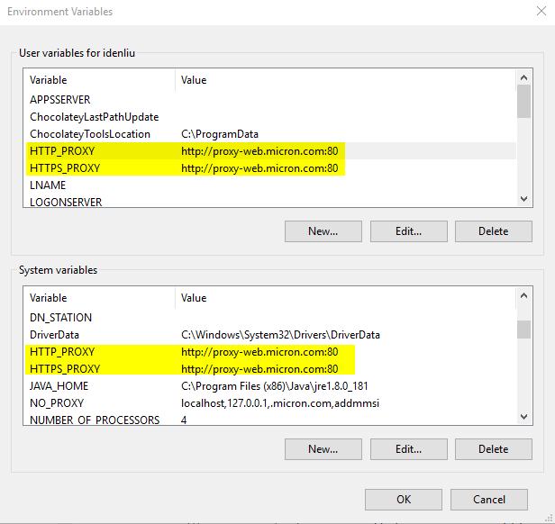

# Protractor E2E Testing 實作環境準備
為了讓Workshop順利進行，請先提前準備您的Protractor運行環境。

## [作業系統]
Windows 7以上，Mac OSX 10.6以上，Linux 最新版本

## [瀏覽器]
### Google Chrome 
* 請更新至最新版
* 請加裝 [Copy css Selector](https://chrome.google.com/webstore/detail/copy-css-selector/kemkenbgbgodoglfkkejbdcpojnodnkg?hl=en-US) 擴充套件

### Mozilla Firefox
* 請更新至最新版

## [套件管理器]
如果不是Mac OSX請略過此步驟。
### Mac OSX Only
[Homebrew - The missing package manager for macOS](https://brew.sh/)
* 需有bash, zsh Shell環境才能裝 (Mac預設bash)

## [IDE環境]
### Git
第一次使用安裝完成後，請先設定您的名字與e-mail

> ### Windows
> [Git](https://git-scm.com/)

> ### Mac OSX
> ```zsh
> :~$ brew install git
> ```


### Node.js
建議安裝 v10.16.3LTS

> #### Windows
>[Node.js](https://nodejs.org/download/release/v10.16.3/)

> #### Mac OSX
> ```zsh
> :~$ brew install node@10
> ```

* #### 安裝後檢查
    ```zsh
    :~$ node -v
    ```
    確認版本是v10.16.3LTS
    
    ```zsh
    :~$ npm -v
    ```
    接著確認版本是v6.9.0


### Visual Studio Code
[VS Code](https://code.visualstudio.com/)
* 安裝擴充套件 [Prettier](https://marketplace.visualstudio.com/items?itemName=esbenp.prettier-vscode)
* 安裝擴充套件 [TSLint](https://marketplace.visualstudio.com/items?itemName=ms-vscode.vscode-typescript-tslint-plugin)
* 安裝擴充套件 [JavaScript (ES6) code snippets](https://marketplace.visualstudio.com/items?itemName=xabikos.JavaScriptSnippets)
* 安裝擴充套件 [Todo Tree](https://marketplace.visualstudio.com/items?itemName=Gruntfuggly.todo-tree)

### Java SE Runtime Environment 1.8
[JRE 1.8](https://www.oracle.com/technetwork/java/javase/downloads/jre8-downloads-2133155.html)
若有使用到 Selenium Standalone Server，你的開發環境需有安裝JRE 1.8以上才能正常執行。
法辦法在官網下載時，請使用 http://sam/ 安裝。


* #### 安裝後檢查
    ```zsh
    :~$ java -version
    ```
    確認版本為v1.8或以上


## [Protractor執行環境]
### Protractor
```zsh
:~$ npm install -g protractor
```
安裝protractor、webdriver-manager以及Protractor API

* #### 安裝後檢查
    ```zsh
    :~$ protractor --version
    ```
    有出現版本資訊表示Protractor可以正常工作

### webdriver-manager保持最新版
```zsh
:~$ webdriver-manager update
```
Web Driver Manager用來啟動Selenium Server。

* #### 安裝後檢查
    測試能否正常啟動Server
    ```zsh
    :~$ webdriver-manager start
    ```
    啟動成功後，開啟瀏覽器檢查一下這個網址 http://localhost:4444/wd/hub


* #### 糟遇錯誤時請參考

    * ##### 沒辦法通過授權，出現下圖錯誤時

        

        如果沒辦法通過授權，請使用這個
        ```zsh
        :~$ webdriver-manager update --ignore_ssl=true
        ```

    * ##### Curl Connection Socket 無法建立時
        
        
        請設定proxy

        


## [確認Protractor正常運作]
* 下載範本
    ```zsh
    :~$ git clone https://github.com/iden1109/protractor-practice.git
    :~$ cd protractor-practice
    ```

* 安裝npm套件
    ```zsh
    :~$ npm install
    ```
    
    ```zsh
    :~$ npm login
    ```
    (登入取得授權，如果需要的話)

* 執行Protractor測試
    ```zsh
    :~$ npm test
    ```

* 確認有出現下方的執行結果，表示Protractor能正確執行測試案例

    


## [Reference]
* [Setting Up Protractor](https://www.protractortest.org/#/tutorial)
* [FaQ](https://github.com/angular/protractor/blob/master/docs/faq.md)

